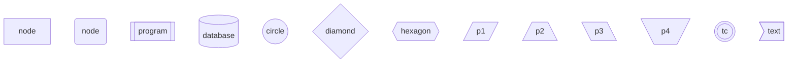
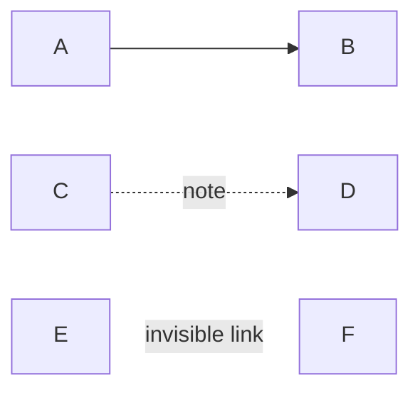

## 什么是mermaid

mermaid 是一个通过纯文本生成图表的 JS 库，任何JS 运行环境都可以解析 mermaid 标记语言以快速展示或者生成图表。甚至目前很多 markdown 编辑器都内置支持 mermaid 语法。

```sh
npm install mermaid # node.js
```

而typora也内置了mermaid解析器，可以通过代码块的形式编写mermaid。

````text
```mermaid
graph_type ...

```
````

## 基础语法

一些适用的语法知识点：

* 单行注释：`%% `，请不要忘记住%%后必须接空格符 

* 在绘制图表前，需要声明图表的类型
* 图表中的unicode文本需要适用双引号包裹起来，最佳实践是所有文本都先使用双引号进行包裹
* 图表中的文本是支持简易markdown语法的，需要使用反引号``包裹起来，并且反引号内是可以识别换行符的。（和js中的反引号概念差不多）

## 节点

大部分图，都需要使用节点这个概念，一般节点的表示方式：`label[text]` 。需要注意的是：节点的形状是通过括号来表示的。例如：`[]`显示方形、`()`显示操场形等。

需要注意的是：同名节点不会展示为两个，后者形状会覆盖前者。

节点更简洁的方式是`text` 不带有方括号则直接将文本当做节点，对于初学者并不推荐这样的写法，非常有迷惑性。

以下是流程图中的节点形状的表示法。



在 v11.3.0 版本中引入形状的扩展语法：`id@{shape: rect, label: "text"}`，更多 shape name 可以去官网查表。

有了节点的扩展语法，甚至可以引入 icon 或者 img 来表示节点。具体用法见官网。

## 节点的连接

大部分图表的节点都需要连接，以流程图为例



遗憾的是，不同图表中的节点，其连接方式的标记语法各不相同，使用时需要自行查阅。

## 图表方向

图表内的节点通常是有延展的方向的，在声明图表类型时可以声明图表的延展方向

- TB - 从顶到底(Top to Bottom)
- TD - 自上而下/从顶到底(Top-down/Top to Bottom)
- BT - 从下到上(Bottom to Top)
- RL - 右到左(Right to Left)
- LR - 左到右(Left to Right)

## 常用图表类型

* flowchart
* sequence
* classDiagram
* xychasrt-beta
