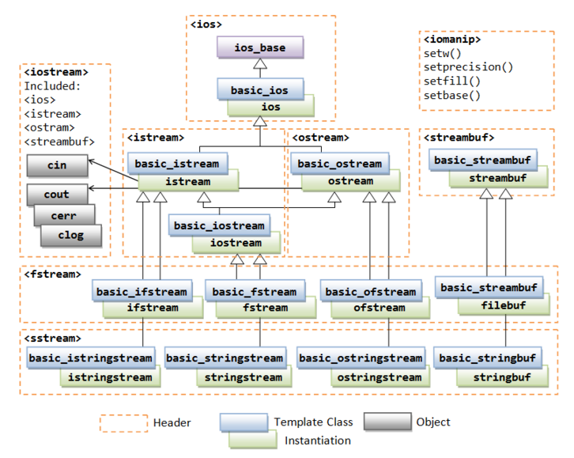
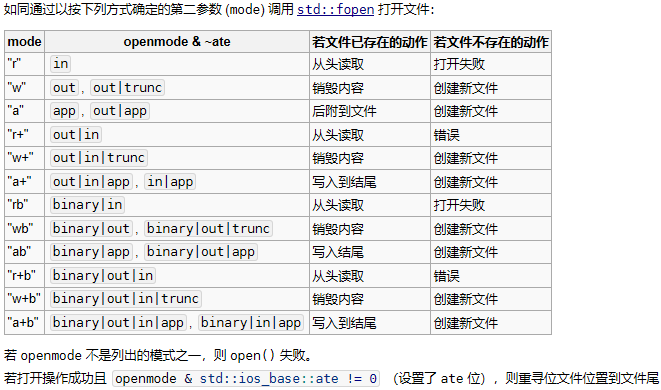

## C++流的继承关系图



## ios_base

ios_base是所有流类的基类，它定义了所有流的公共接口。

特点：
1. ==删除了的拷贝构造和赋值构造函数==，所有流对象都没有拷贝语义相关操作。
2. ios_base中有三个非常重要的位掩码类型 `openmode`，`iostate`，`seekdir`。

### openmode（打开模式）

* in（只读）
* out（只写）
* app（每次写入前都寻位到流结尾）
* binary（二进制方式打开文件）
* trunc（打开文件时舍弃流的全部内容，若不存在文件则创建文件）
* ate（打开文件后立即寻位到末尾）

因为标准输入输出流的构造函数是protected，所以一般在文件流和字符串流中才讨论openmode。

### iostate（状态标志）

* goodbit（无错误）
* eofbit（到达文件末尾）
* failbit（读写操作失败，可恢复的错误）
* badbit（不可恢复的流错误）

一般输入流才会发生阻塞，==流的状态发生改变后流的所有操作不会阻塞==，所以一般对流进行操作后要判断流的状态，进行错误处理。

在ios中定义了判断对应状态的成员函数`good()`、`bad()`、`fail()`、`eof()`，以及清除状态的成员函数`clear()`。

还提供了`operator!`和`operator bool`来简化状态判断。（内部调用了`fail()`。）

### seekdir（寻位）

* beg（文件开头）
* cur（当前位置）
* end（文件末尾）

标准输入输出流中seekdir并没有用处，因为一般不会去对标准输入输出进行偏移。所以一般文件流和字符串流中使用。

## 标准输入输出流

标准输入输出流在`<iostream>`文件中提供了四个实例对象`cin`、`cout`、`cerr`、`clog`。

## 文件流

### 打开文件

```cpp
ifstream ifs("test.txt", std::ios_base::in);
ofstream ofs("test.txt", std::ios_base::out);

ifstream ifs;
ifs.open("test.txt");

ifs.close(); // 关闭文件流，释放资源
```

实际上这两种方式都是通过重定向`rdbuf()->open(filename, mode)`来打开文件的。而filebuf类的open成员函数打开模式实际上是采用std::fopen函数打开模式的规则，并在此基础上增加了binary的打开方式。fopen在`<cstdio>`头文件中。



openmode的某些组合可能导致文件打开失败，而有些组合可能在不同 的编译器、不同的操作系统上有不一样的表现。

注意：
1. 使用out默认会截断文件，即便不使用trunc。只有`out | app`或者`out | in`才不会清空文件。
2. `app`和`ate`的区别在于，`app`进行写操作时立刻将文件位置移动到文件末尾，结束写操作后回到原来的文件位置。而`ate`则直接将文件位置移动到文件末尾。这直接影响偏移量的设置。
3. `in`不会创建新文件，如果文件不存在则改变流状态。通常使用这个规则检测文件是否存在。
4. 只要`trunc`没被设定，都可以使用`app`。

### operator<<、operaotr>>重载

`<<`应用于输出流，`>>`应用于输入流。将字节写入到流中，或将字节从流中读取。

自定义类型在使用流时，需要重载`<<`和`>>`运算符。

```cpp
#include <fstream>
#include <string>
using std::ofstream;
using std::string;

struct Point {
    int x, y;
};

// 注意，流只能引用传递，或者使用移动语义，以为删除了拷贝语义
ostream& operator<<(ostream& os, const Point& p) {
    os << "(" << p.x << ", " << p.y << ")";
    return os;
}

int main() {
  ofstream ofs("test.txt");
  ofs << Point{1, 2} << endl;
  return 0;
}
```

### 偏移量、读写位置

#### seekp、seekg、tellp、tellg成员函数

seekp、seekg用于设置读写位置，tellp、tellg用于获取当前读写位置。p表示put，g表示get。

```cpp
// 设置读写位置
ifs.seekg(10); // 从文件开头偏移10个字节
ofs.seekp(-10, std::ios_base::cur); // 当前位置向前移动10个字节

// tellp、tellg成员函数没有参数，返回相对于文件开头的偏移量
// 获取文件的大小
ifs.seekg(0, std::ios_base::end);
auto pos = ifs.tellg();
```

#### rdbuf()成员函数

重定向函数，返回值类型是`streambuf*`。非常好用也非常容易core dump。空参调用返回指向当前流的缓冲区指针，有参数时改变当前缓冲区到参数的缓冲区。每一个流都有自己的缓冲区，通过这个函数可以改变流的缓冲区，达到重定向的效果。但是要注意重复释放缓冲区的问题。

::: code-tabs

@tab 错误用法
```cpp
std::ofstream log("log.txt");
std::cout.rdbuf(log.rdbuf());
// core dump，因为log和cout析构时释放了同一个缓冲区
```

@tab 解决方案
```cpp
std::ofstream log("log.txt");
auto store = cout.rebuf();
cout.rdbuf(log.redbuf());
// cout << ...
cout.rdbuf(store);
// 将cout恢复到原来的缓冲区，防止core dump
```

@tab 拷贝文件
```cpp
// 读取文件，然后拷贝文件
std::ifstream ifs("test1.txt", std::ios_base::in | std::ios_base::binary);
std::ofstream ofs("test2.txt", std::ios_base::out | std::ios_base::binary)
ofs << ifs.rebuf();
// 输出流重载了operator<<
// basic_ostream& operator<<( std::basic_streambuf<CharT, Traits>* sb );
```

:::

### getline

getline的功能是读入一段==字节流==，默认分隔符是`\n`。

getline有两种用法，一种是==输入流==的成员函数（输出流中没有这个成员函数），另一种是`<string>`文件中定义的普通函数。

::: code-tabs

@tab `<string>`内的getline普通函数
```cpp
// 常见的函数声明
// istream& getline(istream& input, string& str, char delim = '\n');
#include <string>
#include <iostream>
#include <fstream>

int main() {
    std::string line;
    std::ifstream ifs("test.txt");
    while(getline(ifs, line)) {
        std::cout << line << std::endl;
    }
    return 0;
}
```

@tab 输入流内的getline成员函数
```cpp
// 常见的函数声明
// istream& getline(char* str, int count, char delim = '\n');
#include <iostream>
#include <fstream>

int main() {
    std::ifstream ifs("test.txt");
    int bufferSize = 256;
    char* p = new char[bufferSize];
    while(ifs.getline(p, bufferSize, '\n')) {
        std::cout << p << std::endl;
    }
    delete[] p;
    return 0;
}
```
:::

注意：
1. count是指，在指定的count字节内如果没有遇到分隔符，立即返回。
2. 在count字节内遇到delim，**会**读取delim并舍弃它，但**不会**放入str数组内。

## 字符串流