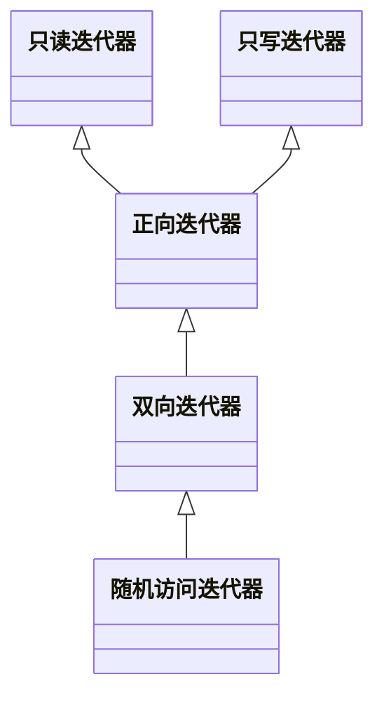

目录

[[TOC]]


STL 提供了通用模板和函数，实现了对常用算法和数据结构的封装。

通常而言可以 STL 可以分为六大组件：

+ 容器（Containers）：各种数据结构的封装
+ 迭代器（Algorithms）：指针的封装
+ 算法（Iterators）：常用算法的封装
+ 仿函数（Functors）：重载了 operator()的类或者模板，看上去像调用了函数，实则是调用类的()重载函数。
+ 适配器（Adapters）：对部分容器和迭代器的封装
+ 配置器（Allocators）：管理容器的内存分配和释放

## 容器
学习容器的过程

1. 理解容器存储的底层数据结构
2. 常用操作（构造、查改，增删），对应迭代器的类型
3. 依赖底层数据结构可能出现的特殊操作


### vector
底层原理：动态数组。

迭代器：随机访问迭代器

::: code-tabs

@tab 初始化
```cpp
#include <vector>
using std::vector;

vector<int> a(10);//创建10个元素
vector<int> a(10, 2);//第一个参数表示元素个数，第二表示元素的值

//注意：使用了花括号初始化，所以容易造成误解
vector<int> a{10};//创建一个元素，值为10
vector<int> a{10, 2};//创建两个元素，值为10和2

vector<int> b{a};//拷贝构造
vector<int> b = a;//拷贝构造
vector<int> b = {1, 2, 4};//列表初始化

vector<int> c{b.begin(), b.end()};//迭代器
```

@tab 查改
```cpp
vector<int> a = {0, 1, 2, 3, 4};

a.at(3);//带越界检查的访问
a.front();//取第一个元素
a.back();//取最后一个元素

//使用随机访问迭代器进行访问

cout << a[2];//直接使用下标可以访问，需要注意越界问题
a[2] = 11;//是否可以修改得看存储的元素是否重载了operator=

vector<int>::iterator it = find(a.begin(), a.end(), 3);//算法库find
```

@tab 增删
```cpp
vector<int> a{10};

a.push_back(11);//末尾插入一个元素
a.empalce_back(11);//C++11引入的新push方法，更高效
a.pop_back();//末尾弹出一个元素

//不支持push_front和pop_front，原则上不应该对vector进行头插，效率很低
//但是仍然可以使用insert实现

vector<int>::iterator it;

//insert方法返回指向插入位置的迭代器
it = a.insert(a.begin(), 11);//在头部插入元素
it = a.insert(a.begin()+2, 10, 3);//在指定位置前，插入10个3元素
it = a.insert(a.begin()+2, {12, 13, 14});//在指定位置前，插入一系列元素

//erase方法返回删除元素后，指向未遍历的第一元素的迭代器
it = a.erase(a.begin()+1);//指定位置删除
it = a.erase(a.begin(), a.begin()+2);//指定范围删除	
```

:::

特殊操作：

因为 vector 是动态数组存储数据，所以插入可能会发生扩容或者移动。

```cpp
vector<int> v;

a.data();//返回底层数组的指针，危险操作，因为vector可能发生移动
v.reserve(10);//预留10个元素的位置
v.capacity();//返回动态数组的容量
v.size();//返回元素个数
v.shrink_to_fit();//移除未只用的容量空间
```

删除引发迭代器失效问题

```cpp
vector<int> t = {1, 2, 3, 4};
for(auto it = t.begin(); it!=t.end();){
    if(*it == 1) {
        it = t.erase(it);
    }
    else {
        it++;
    }
}
```

### deque
底层原理：逻辑连续，物理分片的空间。

目的是为了实现插入操作不需要像 vector 一样后续元素全部移动，而是扩容或者移动相应的区间即可。常用于双端队列。

迭代器：随机访问迭代器。

::: code-tabs

@tab 初始化
```cpp
//构造方式和vector相同，不多叙述
```

@tab 查改
```cpp
//查改和vector相同，不多叙述
```

@tab 增删
```cpp
//deque就是为了实现双端队列，

deque<int> a = {1, 2, 3};

//所以在vector的基础上，增加了头插
a.push_front(0);
a.pop_front(1);

//inert和earse方式一样，不多叙述
```

:::

迭代器失效问题。cppreference.com 没有明确叙述，略。

### list
底层原理：双向链表

迭代器：双向访问迭代器

::: code-tabs

@tab 初始化
```cpp
#include <list>
list<int> a(10);//创建10个元素
list<int> a(10, 2);//创建10个2

list<int> a{10};//创建1个元素，为10

list<int> b(a);
list<int> c = a;//拷贝构造

list<int> a = {10};//列表初始化

list<int> b(a.begin(), a.end());//迭代器指定范围构造

//可见，构造方式和vector一模一样
```
@tab 查改
```cpp
list<int> a = {1, 2, 3, 4};

a.front();//查找第一个元素
a.back();//查找最后一个元素

//没有at方法，也不能使用operator[]方法，因为是双向迭代器
```

@tab 增删
```cpp
list a = {1, 2, 3, 4};

//insert方法同vector，不多赘述
//erase方法同vector一样，不多赘述

//提供push_back,pop_back,push_front,pop_front方法，用法同vector
```

:::

### set
底层原理：红黑树

迭代器：双向访问迭代器

```cpp
template<
typename Key,
typename Compare = std::less<Key>,
typename Allocator = std::allocator<Key>
>
class set;

//其中std::less是个重载了operator()
template<classname T>
struct less {
    constexpr bool operator()(const T &lhs, const T &rhs) const {
        return lhs < rhs;
    }
};


//可见，set模板默认的key比较方式是使用两个元素采用`<`进行比较
//Compare必须是二元谓词
```

因为 set 本质上就是拿数据作为红黑树的 key，所以元素必须要存在一个可比较的方式，如果要使用 set 的方式进行存储，必须要关注 set 的 Compare 是什么。为了使用 set 存储某种特定类型的数据，有以下方案：

1. 满足 Compare 二元谓词内部的比较条件
2. 自定义 Compare 二元谓词
3. 特化 Compare

::: code-tabs

@tab 方法1
```cpp
//类内部重载<运算符
set<int> s{1, 2, 4};
set<int> s = {1, 2, 4, 4};//列表初始化
set<int> s2{s.begin(), s.end()};//使用迭代器指定范围
set<int> s2(s);//拷贝构造

class Point {
public:
    bool operator<(const Point &rhs) const {
        return this->dist() < rhs.dist();//在内部重载，满足了默认的Compare,std::less的`<`比较
    }
    double dist() const { return _x * _x + _y * _y; }
private:
    double _x, _y;
};
```

@tab 方法2
```cpp
//全局重载<运算符
bool operator<(const Point& lhs, const Point& rhs) {
    return lhs.dist() < rhs.dist();
}
```

@tab 方法3
```cpp
//特化less，让std::less处理Point类时使用自定义的函数
template<>
struct less<Point> {
    bool operator()(const Point &lhs, const Point &rhs) {
        return lhs.distance() < rhs.distance();
    }
};

//方法1/2/3，都是通过满足Compare的比较条件来实现
set<Point> s{{11, 3}, {2, 1}};
```

:::

```cpp
//----------------------------------------------------------------
//情况2，修改Compare

//方法1，定义函数对象
//需要注意的是，函数对象需要提供一个默认构造函数，（或者说可以Compare()创建实例的）
//如果没有，则需要实例化容器时，传入比较函数对象
struct myCompare {
    bool operator()(const Point &lhs, const Point &rhs) {
        return lhs.distance() < rhs.distance();
    }
};

set<Point, myCompare> set = {{11, 3}, {2, 1}};


//方法2，定义匿名函数
auto myCompare = [](const Point& lhs, const Point& rhs) -> bool {
    return lhs.dist() < rhs.dist();
}

//匿名函数，没有默认构造函数，所以需要显式传入一个该函数对象
//匿名函数是实例，模板中要填入类型，使用decltype()获取实例的类型
set<Point, decltype(myCompare)> set({{1, 2}, {22, 1}}, myCompare);

```

比较函数的实现规范：

`Compare`函数必须要符合**严格弱序**的要求。

STL 中 set 会排除 key 相等的情况，例如 `set<int> s = {1, 1, 1};`最终只会存入一个 1。

具体的实现原理是调用两次`Compare`二元谓词，第二次调用时交换参数的传入顺序，最终根据两次调用结果来判断是否两个元素是否相等。

内部判断机制是 `!Compare(x, y) && !Compare(y, x)`，只有严格弱序才能通过。

```txt
2 < 1 --> false
1 < 2 --> true
===========
1 < 1 --> false
1 < 1 --> false
=> 说明两者相等

如果自定义比较规则不符合严格弱序，则可能出现未定义行为
1 <= 1 --> true
1 <= 1 --> true
=> 元素相等，但是可插入set
```

为了维护 set 元素唯一性的规则（这样才能合理使用一些 STL 算法，而不产生未定义行为）

必须保证严格弱序，通常自定义的比较规则都采用 `<` 来实现比较安全。

```cpp
//1. 只能使用迭代器进行遍历,
//2. 因为元素直接作为key，修改了会引起重排，所以没有api去修改
//3. 不能使用[]进行查询

set<int> s = {1, 2, 3, 4};

//it是迭代器，知晓找到元素的所在位置，如果不存在则是s.end()
auto it = s.find(3);

//计数，但由于set元素唯一的特性，
//返回值只有1和0，所以这个方法也可以用来判断元素是否存在
auto cnt = s.count(3);
```

因为 set 底层采用的是红黑树，所以进行遍历的时候采用的是**中序遍历，**

比较函数为 `std::less` 情况下，中序遍历返回升序结果。STL 提供了 `std::greater`，采用 `>`比较可以实现降序排序。

```cpp
set<int> a = {1, 2, 3, 4};

//ret返回类型时pair<std::set::iterator, bool>
//ret.second表明是否插入成功，true为成功，ret.first返回成功插入后指向该元素的迭代器
auto ret = a.insert(10);
a.insert({3, 2, 3});//列表初始化方式插入
b.insert(a.begin(), b.end());//迭代器范围插入

//指定擦除
//cnt表示擦除的个数，由于key的唯一性，所以成功擦除为1，失败为0
auto cnt = a.erase(a.begin());
a.erase(a.begin(), a.end());
```

### multiset
底层原理：红黑树

迭代器：双向访问迭代器

底层逻辑基本和 set 是一样的，只是在插入时不要求删除相同的 key。所有操作都可以依照 set 来进行。

注意：比较函数仍然需要遵循严格弱序，这样相同的 key 能够在内存中连续储存。

由于可以插入相同 key 值，有些 API 有一点不同。

```cpp
#include <set>
multiset<int> a = {1, 1, 2, 2, 3, 4, 5, 5};

//这里的it类型并不是std::pair<iterator, bool>
//因为插入操作总是成功，所以直接返回迭代器
auto it = a.insert(3);

//直接删除所有的key = 1的元素，返回删除的个数
int cnt = a.erase(1);

//只删除一个元素的方式
a.erase(a.find(1));

find(a.begin(), a.end(), 1);
```

### map
底层原理：红黑树

迭代器：双向访问迭代器

可以理解为 set 的进阶版，只是 map 存储的实际上是一个 `std::pair`对象，并将 `first`作为键，`second`作为值。

::: code-tabs

@tab 初始化
```cpp
#incldue <map>
//列表初始化方式
map<int, string> m({{1, "one"}, {2, "two"}});
map<int, string> m = {{1, "one"}, {2, "two"}};

//迭代器范围初始化
map<int, string> m2(m.begin(), m.end());

//拷贝构造
map<int, string> m3(m);
map<int, string> m3 = m;

//同样可以自定义Compare函数，这种方式具体参考set
map<int, string, std::greater> m4;
```

@tab 查改
```cpp
map<int, string> m = {{1, "one"}, {2, "two"}};

//通过key查找value，ret = "two";
//但这种方法是有风险的，查找的key不存在，直接抛出错误
auto ret = m.at(2);

//通过[]运算符查找value
//但这种做法同样有风险，查找的key不存在，直接进行插入
auto ret = m[1];

//计算key的个数，由于默认key唯一，
//所以可以用作判断key是否存在
auto ret = m.count(1);

//通过key查找相应的pair，返回的是迭代器
//如果没有找到则it = m.end()
//这是最安全的做法，获取迭代器后可进行修改操作
auto it = m.find(2);

//直接通过[]修改，但是有插入风险
m[1] = "one1";

//通常map可能会根据值来查询，那么就可以通过这个方法来查找
auto it = find_if(m.begin(), m.end(), [](map<int, string>& a) -> bool {
    return a.second == "two";
}
```

@tab 删增
```cpp
map<int, string> m = {{1, "one"}, {2, "two"}};

//直接通过[]运算符增加或者修改
m[1] = "one2";

//同set一样，insert操作很可能是不会成功的，
//ret的类型是std::pair<std::map::iterator, bool>
auto ret = m.insert({3, "three"});
m.insert(m.begin(), m.end());//迭代器范围插入

m.erase(m.begin());//迭代器指定删除
m.earse(m.begin(), m.end());//迭代器范围删除
```

:::

### multimap
底层原理：红黑树

迭代器：双向访问迭代器

实际上可能出现的问题以及 api 的变化和问题跟 set 和 multiset 是完全一样的。不多赘述。

### unordered_set, unordered_multiset
底层原理：哈希表。

迭代器：前向访问迭代器。


关于哈希的重要概念：

+ 哈希函数
+ 哈希冲突
+ 桶
+ 负载因子（装载因子）

本质上就是通过一个哈希函数将元素映射到一个数组的下标，并将元素挂载到该位置上。

所以某个层面上，能将元素和下标一一相对应的哈希表就是数组。

通常而言，数组长度有限，那么就势必会造成多个元素映射到一个数组下标，这称之为哈希冲突。

数组在这个位置会存储一个地址，指向一个数据结构（通常是链表），这称之为桶。数组的元素个数称为桶的数量。桶会存储哈希冲突的元素。


哈希表解决了访问效率的问题，因为通过哈希函数找到相应的桶的时间复杂度为 `O(1)`。但是一旦桶内的元素过多时查询不见得高效。

STL 提供了一种默认的评估标准，负载因子：` 负载因子 = 总元素数量 / 桶数量 = 1 `。

一旦负载因子超过 1，则会对桶数量扩容，所有元素重新散列，这是一个昂贵的操作。


_<font style="color:#8A8F8D;">负载因子等于 1 意味着效率最高的分布情况是：每个桶上刚好只有一个元素。所以说，数组实际上是最完美的哈希表，元素的哈希值就是数组下标。实际情况是哈希冲突总是难以避免的。</font>_


```cpp
//默认使用的哈希函数时std::hash
//实际上自定义哈希函数需要满足的函数签名
size_t myHash(const T&);


//std::equal_to的可能实现
template<typename T>
struct equal_to {
    constexpr bool operator()(const T &lhs, const T &rhs) const 
    {
        return lhs == rhs;
    }
};
```

设计哈希函数的准则：

1. 必须具有唯一性，即相同的元素能唯一映射成一个数

2. 尽量做到映射均匀分布


为什么需要判等的比较函数？

在 set 容器中可以直接通过 Compare 函数的严格弱序性质来判等，而 unordered_set 的哈希函数只是判定元素位于哪个桶上，所以还需要一个判等的比较函数来确定桶内元素是否存在。或者说查找的时候需要使用判等来确定元素。


```cpp :collapsed-lines="15"
#include <unordered_set>

//情况1，存储内置类型
unordered_set<int> uset(11);//指定桶的数量，通常是质数

//初始化列表形式
unordered_set<int> uset({1, 2, 4, 4}, 11);//可以指定桶数量
unordered_set<int> uset = {1, 2, 4, 5};

unordered_set<int> uset1(uset.begin(), uset.end(), 19)//迭代器范围指定，可以指定桶数量

//====================================================
//情况2，存储自定义类型，需要指定哈希函数和比较函数

//自定义哈希函数
//方法1：自定义函数对象，并实现如下接口
size_t operator()(const T&) const;

//方法2：特化std::hash
template<>
struct hash<T> {
    size_t operator(const T&) const;	
};

//注意：std::hash高度依赖类型，所以没有提供通用的哈希函数，
//因此不能像set容器一样，在自定义类当中重载`<`，以满足std::less的方法

//------------------------------------
//必须同时提供比较函数
//std::equal_to是通用实现，内部机制就是使用==来判等

//方法1：自定义函数对象，并实现如下接口
bool operator==(const T& lhs, const T& rhs) const;

//方法2：特化std::equal_to

//自定义类内部重载==
bool operator==(const T& other) const;
```

其余的增删改查和 set 没有太大区别

```cpp
unordered_set<int> uset = {1, 2, 4, 5};

//迭代器可以直接指向具体的桶起始位置
uset.begin(3);
uset.end(3);

//返回桶的数量
int cnt = uset.bucket_count();

//返回指定下标的桶所包含的元素数量
int cnt = uset.bucket_size(0);

//传入key值，返回所在桶的下标
int idx = uset.bucket(3);
```

### unordered_map, unordered_multimap
底层原理：哈希表

迭代器：前向访问迭代器

可以说是前面对应容器的结合版，并且 API 没有多大变化。

## 迭代器
STL 中提供了五种迭代器：

+ 输入迭代器：负责从容器中读数据，支持解引用，只能向前
+ 输出迭代器：负责向容器中写数据，支持解引用，只能向前
+ 正向迭代器
+ 双向迭代器
+ 随机访问迭代器

容器所使用的迭代器只有正向、双向、随机访问迭代器，而输入输出迭代器通常给只遍历一次的算法使用，STL 容器只是用了正向、双向、随机访问迭代器三种。

他们的继承关系如下：



以下用 `it`表示迭代器

### 前向访问迭代器
+ 解引用运算符 `*`，和箭头运算符 `->`，数据可读可写
+ 前置 `++`和后置 `++`
+ 比较操作 `==`和 `!=`

### 双向访问迭代器
+ 包含前向访问迭代器所有操作
+ 前置 `--`和后置 `--`

### 随机访问迭代器
+ 包含前向和双向迭代器的所有操作
+ 和整数的运算 `+`,`+=`,`-`,`-=`
+ 两个迭代器的减法运算 `-`
+ 支持 `it[n]`运算，相当于以 it 指向的元素为起点，做整数运算并解引用
+ 支持比较运算符 `<`,`<=`,`>`,`>=`

### 根据迭代器对容器进行分类
前向迭代器：

+ `std::forward_list`（单向链表）
+ `std::unordered_set`（哈希集合）
+ `std::unordered_map`（哈希映射）
+ `std::unordered_multiset`（哈希多重集合）
+ `std::unordered_multimap`（哈希多重映射）

双向迭代器：

+ `std::list`（双向链表）
+ `std::set`（红黑树，有序集合）
+ `std::map`（红黑树，有序映射）
+ `std::multiset`（红黑树，有序多重集合）
+ `std::multimap`（红黑树，有序多重映射）

随机访问迭代器：

+ `std::vector`（动态数组）
+ `std::deque`（逻辑连续，底层分片存储，双端队列）
+ `std::array`（固定大小数组）
+ `std::string`（动态数组，属于存储字符的特殊容器，支持随机访问迭代器）


## 算法
STL 提供了很多可以直接应用在容器上的算法，需要注意的是这些算法对容器的迭代器有要求。

### find/find_if/find_if_not
迭代器要求：输入迭代器

返回找到的第一个元素

```cpp
//具体find实现
template<class InputIt, class T = typename std::iterator_traits<InputIt>::value_type>
constexpr InputIt find(InputIt first, InputIt last, const T& value)
{
    for (; first != last; ++first)
        if (*first == value)
            return first;
 
    return last;
}

//find_if
template<class InputIt, class UnaryPred>
constexpr InputIt find_if(InputIt first, InputIt last, UnaryPred p)
{
    for (; first != last; ++first)
        if (p(*first))
            return first;
 
    return last;
}

//find_if_not
template<class InputIt, class UnaryPred>
constexpr InputIt find_if_not(InputIt first, InputIt last, UnaryPred q)
{
    for (; first != last; ++first)
        if (!q(*first))
            return first;
 
    return last;
}
```

```cpp
//实际上内部只是使用了`lhs == rhs`来判断是否相等
//所以自定义类型需要重载==，或者全局重载==运算符

iterator it = find(a.begin(), a.end(), 3);

//提供一个一元谓词，参数类型为容器类型
iterator it = find_if(a.begin(), a.end(), [](auto & it) -> bool {/**/};);

//同上
iterator it = find_if_not(a.begin(), a.end(), [](auto & it) -> bool {/**/};);
```

### for_each
迭代器：输入迭代器

遍历指定的元素

```cpp
for_each(a.begin(), a.end(), [](auto & item) -> void {/**/});
```

### accumlate
迭代器：输入迭代器

相当于 JS 中数组的 reduce 方法，对累加操作非常方便

```cpp
//内部实现机制是`lhs + rhs`，所以自定义类型需要重载`+`运算符
int ret = accumulate(a.begin(), a.end(), 0);

//可以自定义二元操作
int ret = accumulate(a.begin(), a.end(), 0, [](auto &a, auto &b) -> int {});
```

### count/count_if
迭代器：输入迭代器

相当于 foreach 一遍，并给出统计结果

```cpp
int cnt = count(a.begin(), a.end());

//func是一元谓词
int cnt = count_if(a.begin(), a.end(), func)
```

### sort
迭代器：随机访问迭代器

对容器内元素进行**就地排序**，通常就用在 vector 上。

内部机制算法：插入排序、快速排序、堆排序的混合，当规模较小时使用插入排序，一般规模使用快排，递归深度很深时用堆排序。

```cpp
vector<int> v = {3, 2, 1, 4};
sort(v.begin(), v.end());

//自定义类型排序时，需要提供一个比较函数对象（二元谓词）
//从逻辑上应当遵守lhs比rhs小时返回true
//func是二元谓词
sort(p.begin(), p.end(), func);
```

### remove/remove_if
迭代器：前向迭代器

但是这两个 api 只能用在序列容器上，如 vector, list, string 上。

实际上并没有真的删除元素，而只是将后续的元素往前覆盖而已。

```cpp
template<class ForwardIt, class T = typename std::iterator_traits<ForwardIt>::value_type>
ForwardIt remove(ForwardIt first, ForwardIt last, const T& value)
{
    first = std::find(first, last, value);
    if (first != last)
        for (ForwardIt i = first; ++i != last;)
            if (!(*i == value))
                *first++ = std::move(*i);
    return first;
}
```

源码解读：

1. 开始时，两个指针 first 和 i 同时指向同一个元素
2. 如果元素不是要删除的值，则将 i 指向的元素赋给 first 指向的元素，同时向前移动
3. 如果元素是要删除的值，则 first 不动，而 i 向前移动
4. 循环 2 和 3

实际的效果就是，first 和 i 从左到右同时开始遍历，没找到目标值之前一直是同步向前移动，并进行自赋值。当遇到目标值时，移动 i 直到遇到非目标值，则将该值赋值给 first 以达到覆盖的作用。自此之后两个指向的位置是不同的，自赋值操作变成了覆盖操作。

这样的算法时间复杂度只有 O(N)，非常高效。

但是 remove/remove_if 并不是真正的删除操作，而是进行覆盖，所以返回值是指向第一个无效元素的迭代器。通常要配合 erase 来进行真正的删除。

```cpp
string s = "hello;;;;;world";

//s == "helloworldworld"，it返回值是指向第一个无效元素的迭代器
auto it = remove(s.begin(), s.end(), ';');

//s == "helloworld"，真正的删除
s.earse(remove(s.begin(), s.end(), ';'), s.end());

//func一元谓词，用以判断是否需要删除
remove_if(s.begin(), s.end(), func);
```

## 总结
几乎所有常用的容器本身会把数据放在堆空间，而容器本身数据管理对象，放在栈空间。

几乎所有常用的容器的拷贝构造函数和赋值拷贝，进行的是深拷贝。（当然，并不会递归的进行深拷贝）

## 其他

### std::pair、make_pair

位于 `<utility>` 头文件

在 STL 中非常常用的类型，某些容器的方法或者算法的参数类型或者返回值类型

其成员函数有两个，`first` 和 `second`。

```cpp
#include <utility>
int a = 1;
bool isA = true;
auto pair = make_pair(a, isA);
```