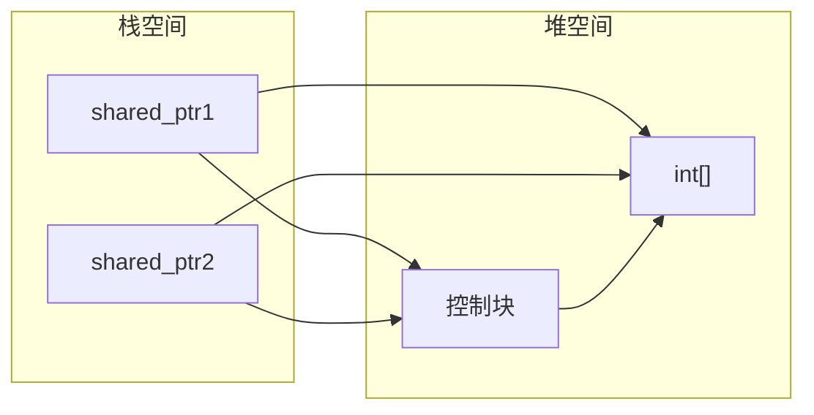
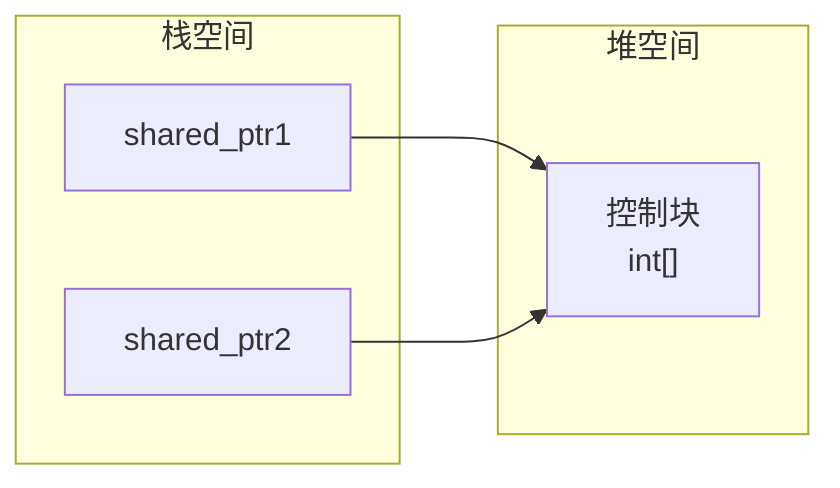

## RAII思想

RAII（Resource Acquisition Is Initialization）是一种使用对象生存周期管理资源的技术。

说来简单，就是在对象构造时获取资源，在析构时释放资源的策略。在C++标准库中非常多场景下都有使用，

例如：容器在初始化时申请堆空间，并在生命周期结束时在析构函数中释放堆空间；互斥锁在构造时加锁，在析构时解锁等等。

```cpp 简单的RAII示例
class A {
    public:
    A(int a) {
        _p = new int(a); // 构造时分配资源
    }
    A(int* b = nullptr) {
        _p = b; //构造时接管外部资源
    }
    /* ... */
    ~A() {
        if(_p) delete _p;
    }
    private:
    int * _p;
};

int main() {
    A a(10);
    A b = new int(20); // 不需要手动 delete
}
```

## 智能指针

C++11 引入了`unique_ptr`、`shared_ptr`和`weak_ptr`智能指针，用以方便管理资源，可以当做指针来使用。`unique_ptr`和`shared_ptr`重载了`*`，`->`运算符以及`operator bool()`运算符。`weak_ptr`则是为了解决`shared_ptr`的循环引用问题。

### unique_ptr

* ==删除==了**拷贝构造函数和拷贝赋值函数**，保证拥有资源的唯一所有权。
* 支持移动语义，即可以转移资源所有权。

::: code-tabs

@tab 构造
```cpp
int main() {
    // 报错，因为这里发生了隐式转换，int * --> unique_ptr<int>
    // 然后通过拷贝构造，但是拷贝构造函数被删除了
    std::unique_ptr<int> p0 = new int(10); // [!code error]

    // 正确，直接调用的移动构造函数
    std::unique_ptr<int> p1(new int(10));

    // 推荐，make_unique是C++14引入的，可以避免隐式转换的问题，并且可以保证异常安全
    // 内部使用了new表达式
    std::unique_ptr<int> p2 = std::make_unique<int>(10);

    return 0;
}
```

@tab 转移所有权
```cpp
void test(std::unique_ptr<int> p) {
    /* ... */
}
int main() {
    std::unique_ptr<int> p1 = std::make_unique<int>(10);
    auto p2 = p1; //报错，拷贝构造被删除
    auto p3 = std::move(p1); //正确，移动
    test(std::move(p3)); //正确，只能通过移动语义传递unique_ptr 

    return 0;
}

@tab 裸指针
```cpp
int main() {
    std::unique_ptr<int> p1 = std::make_unique<int>(10);
    // 返回指向资源的裸指针，所有权不变（即仍然需要使用p1来管理资源）
    int * ret1 = p1.get();

    // 释放所有权，返回裸指针
    // 需要手动管理资源，否则会造成内存泄露。
    auto ret2 = p1.release(); 
    delete ret2;

    // reset可以传入裸指针，释放原有资源，接管外部资源
    p1.reset(new int(20));
    // 清空资源（即释放资源，并将指针置为nullptr）
    p1.reset();
    return 0;
}
```

*可以使用形如`const std::unique_ptr<T> &`类型作为函数参数吗？*

并不推荐，因为这会导致语义不明，尽管函数内部可以获得智能指针的引用，但是并不能获得资源所有权。通常来说，可以使用移动语义传递智能指针，或者实参传递智能指针 get 成员函数提供的裸指针。

:::

### shared_ptr

* 允许多个shared_ptr共享资源，使用引用计数来管理资源的生命周期。
* 只有拷贝构造和赋值构造函数以及`release()`成员函数会改变引用计数。
* 实现了拷贝构造函数、重载赋值运算符。
* `use_count()`成员函数可以获取引用计数。

```cpp
int main() {
    std::shared_ptr<int[]> p0(new int[3]{1, 2, 3});
    std::shared_ptr<int[]> p1 = p0; // 正确
    std::shared_ptr<int[]> p2(p0); // 正确

    p2.use_count(); // 返回引用计数
    p2.release(); // 返回裸指针，引用计数减一
    p2.reset(); // 释放资源，引用计数减一
    return 0;
}
```

#### std::make_shared

当使用形如`std::shared_ptr<T> p(new T());`的方式构造shared_ptr时，控制块和资源是分开存储的。



而使用`std::make_shared<T>()`则可以保证控制块和资源在堆空间中是连续分布的，减少了内存碎片。



#### shared_ptr可能引发的问题

::: code-tabs

@tab 重复释放1
```cpp
int main() {
    std::shared_ptr<int> p1 = std::make_shared<int>(10);
    std::shared_ptr<int> p2(p1.get());
}

// 只有拷贝构造才会增加引用计数，这里会创建两个控制块指向同一个资源，且引用计数均为 1。
// 当p1和p2析构时，都会尝试释放资源，导致重复释放。
```

@tab 重复释放2
```cpp
struct A {
    shared_ptr<A> get_ptr() {
        //问题的根源 
        return shared_ptr<A>(this); // [!code error]
    }
};

int main() {
    shared_ptr<A> a(new A);
    shared_ptr<A> b = a->get_ptr();
}

// 使用shared_ptr<A>管理A的裸指针的时候，就会创建一个控制块，
// shared_ptr<A>(this)并不是通过拷贝构造的方式创建的智能指针，所以会创建一个新的控制块
// 两个控制块的引用计数均为1，导致重复释放。
```

@tab 循环引用1
```cpp
struct B;
struct A {
    A(int t):a(t), p(nullptr) {
        cout << "A构造" << endl;
    }
    ~A() {
        cout << "A析构" << endl;
    }
    void set_ptr(shared_ptr<B> b) {
        p = b;
    }

    int a;
    shared_ptr<B> p;
};

struct B {
    B(int t):b(t), p(nullptr) {
        cout << "B构造" << endl;
    }
    ~B() {
        cout << "B析构" << endl;
    }
    void set_ptr(shared_ptr<A> a) {
        p = a;
    }

    int b;
    shared_ptr<A> p;
};

int main()
{
    shared_ptr<A> a = make_shared<A>(10);
    shared_ptr<B> b = make_shared<B>(12);
    a->set_ptr(b);
    b->set_ptr(a);
    return 0;
}

// 两个对象实例相互持有指向对方的shared_ptr，
// 任何一方析构时，都要求对象先释放资源，导致最终都无法释放资源,造成内存泄露。
// 类似于死锁
```

@tab 循环引用2
```cpp
struct C {
    C(int t):c(t), p(nullptr) {}
    void set_ptr(shared_ptr<C> c) {
        p = c;
    }
    int c;
    shared_ptr<C> p;
};

int main() {
    shared_ptr<C> c1 = make_shared<C>(10);
    c1->set_ptr(c1); // 自指

    return 0;
}


// 对象中存在一个指向自己的shared_ptr，
// 引用计数只有在实例销毁了才会变为0，但是销毁自身必须先销毁指向自己的shared_ptr数据成员，
// 循环引用，最终导致内存泄露。
```

循环引用造成的内存泄露非常隐蔽，于是 C++11 引入了weak_ptr和enalbe_shared_from_this来解决这个问题。

:::

### weak_ptr

实际上shared_ptr最大的问题就是引用计数无法降为0，导致内存泄露。

* `weak_ptr`则是`shared_ptr`的弱引用辅助工具，`weak_ptr`访问`shared_ptr`管理的资源，但是不会增加引用计数。所以很多时候`weak_ptr`充当`shared_ptr`的观察者。

* `weak_ptr`私有化了`*`和`->`运算符，需要通过`lock()`成员函数转换为`shared_ptr`才能访问资源。 

```cpp
int main() {
    std::shared_ptr<int> sp = std::make_shared<int>(10);
    // shared_ptr可以隐式转换成weak_ptr
    std::weak_ptr<int> wp = sp; 
    // 引用计数为 1。
    cout << wp.use_count() << endl; 

    // shared_ptr不能直接接收weak_ptr，
    // 需要通过weak_ptr的lock()成员函数转换为shared_ptr。
    std::shared_ptr<int> sp2 = wp.lock();

    return 0;
}
```

可以通过`weak_ptr`解决循环引用问题。

::: code-tabs

@tab 循环引用1
```cpp{16,31}
using std::shared_ptr;
using std::weak_ptr;// [!code word:weak_ptr]
struct B;
struct A {
    A(int t):a(t), p(nullptr) {
        cout << "A构造" << endl;
    }
    ~A() {
        cout << "A析构" << endl;
    }
    void set_ptr(shared_ptr<B> b) {
        p = b;
    }

    int a;
    weak_ptr<B> p; 
};

struct B {
    B(int t):b(t), p(nullptr) {
        cout << "B构造" << endl;
    }
    ~B() {
        cout << "B析构" << endl;
    }
    void set_ptr(shared_ptr<A> a) {
        p = a;
    }

    int b;
    weak_ptr<A> p;
};

int main()
{
    shared_ptr<A> a = make_shared<A>(10);
    shared_ptr<B> b = make_shared<B>(12);
    a->set_ptr(b);
    b->set_ptr(a);
    return 0;
}

```

@tab 循环引用2
```cpp{7}
struct C {
    C(int t):c(t), p(nullptr) {}
    void set_ptr(shared_ptr<C> c) {
        p = c;
    }
    int c;
    weak_ptr<C> p; // [!code word:weak_ptr]
};

```

:::

### enable_shared_from_this模板、shared_from_this()成员函数

C++11标准提供了一个类模板，其中提供了一个`shared_from_this()`公有成员函数，专门给类用来获取指向自身的`shared_ptr`。

* `shared_from_this()`只有在类实例已经被`shared_ptr`管理时才能调用，否则会抛出异常。

```cpp
struct C: public std::enable_shared_from_this<C> {
    C(int t):c(t) {}
    shared_ptr<C> ptr() {
        return shared_from_this();
    }
    int c;
}

int main() {
    C c(10);
    c.ptr(); //报错，c 未被shared_ptr接管 [!code error]

    shared_ptr<C> c = make_shared<C>(10);
    c->ptr(); //正确，c被shared_ptr接管
    return 0;
}
```